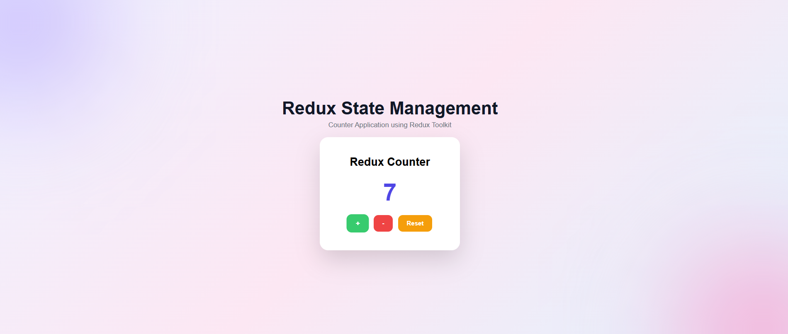
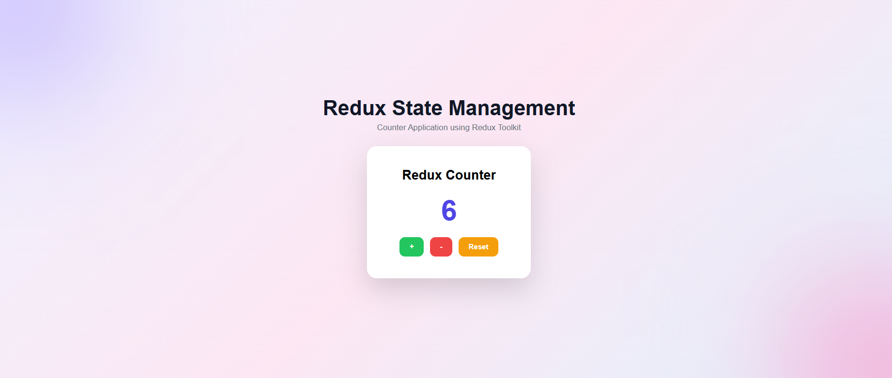
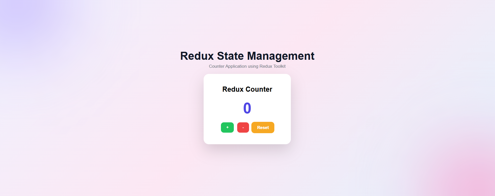
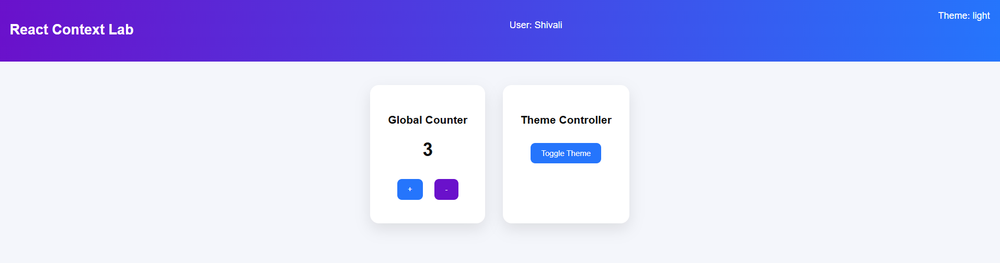
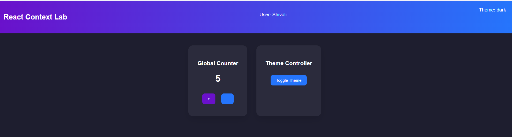

# ⚛️ State Management Using Redux (Counter Application)

This project demonstrates **centralized state management using Redux Toolkit** in a React application by building a simple counter.

The counter value is stored in a **global Redux store** and updated using actions and reducers.

---

## 🎯 Aim

To implement **centralized state management using Redux** in a React application.

---

## 🧠 Theory

Redux is a predictable state container for JavaScript applications.

It stores application data in a **single global store** and updates it using **actions and reducers**.

Redux Toolkit simplifies Redux by reducing boilerplate code and making state management easier.

This helps to:

✔ Manage global state efficiently  
✔ Keep data consistent across components  
✔ Improve scalability of applications  
✔ Simplify complex state logic  

---

## 🛠️ Tech Stack

- React (Vite)
- Redux Toolkit
- JavaScript
- CSS
- Node.js

---

## ⚙️ Features

✅ Increment counter  
✅ Decrement counter  
✅ Reset counter  
✅ Global state using Redux store  
✅ Clean component structure  

---

---

## 📂 Project Structure

```
redux-counter/
│
├── public/
├── src/
│   ├── assets/
    ├── app/
        ├── store.js
    ├── features
        ├── counterSlice.js 
│   ├── components/
        ├── Counter.jsx
│   ├── App.jsx
│   ├── main.jsx
│   └── App.css
│
├── photos/
│   ├── dark.png
│   ├── light.png
│   
│
├── package.json
└── vite.config.js
```
## 📸 UI Screenshots

###  ➕ Increment Counter


---

### ➖ Decrement Counter


---

### 0 Reset Counter



---

## ▶️ How to Run the Project

### 1️⃣ Clone Repository
```bash
git clone https://github.com/Shivi714/FULL-STACK-EXP-4.git
2️⃣ Go to Project Folder
cd redux-counter
3️⃣ Install Dependencies
npm install
4️⃣ Run Development Server
npm run dev
Open browser → http://localhost:5173

---
# 🌐 Global State Management using React Context API

This project demonstrates **Global State Management** in a React Single Page Application using the **React Context API**.

It allows components to share data globally without prop drilling, making state management simpler and more efficient.

---

## 🎯 Aim

To implement global state management in a Single Page Application using the React Context API.

---

## 🧠 Theory

In React applications, passing data through multiple components using props can become complex. This is called **prop drilling**.

The **Context API** provides a way to share global data such as:

- Themes (Light / Dark)
- User information
- Application settings
- Counter state

across components without passing props manually at every level.

Key React functions used:

- `createContext()` → creates global context
- `Context.Provider` → provides global state
- `useContext()` → consumes global state

---

## 🛠️ Tech Stack

- React (Vite)
- JavaScript
- CSS
- Node.js

---

## ⚙️ Features

✅ Global state management  
✅ Theme switching (Light / Dark mode)  
✅ Shared counter state  
✅ No prop drilling  
✅ Clean UI  

---

## 📂 Project Structure

```
context-lab/
│
├── public/
├── src/
│   ├── assets/
│   │
│   ├── components/
│   │   ├── Counter.jsx
│   │   ├── Navbar.jsx
│   │   └── ThemeToggle.jsx
│   │
│   ├── context/
│   │   └── GlobalContext.jsx
│   │
│   ├── App.jsx
│   ├── main.jsx
│   └── App.css
│
├── Photos/
│   ├── light.png
│   └── dark.png
│
├── package.json
└── vite.config.js
```

---

## ▶️ How to Run the Project

### 1️⃣ Clone Repository
```bash
git clone https://github.com/Shivi714/Full-Stack-EXP-4.git
```

### 2️⃣ Go to Project Folder
```bash
cd context-lab
```

### 3️⃣ Install Dependencies
```bash
npm install
```

### 4️⃣ Run Development Server
```bash
npm run dev
```

Open browser → http://localhost:5173

---

## 📸 UI Screenshots

### 🌞 Light Mode


---

### 🌙 Dark Mode



---

## 📈 Benefits of Context API

- Eliminates prop drilling
- Centralized state management
- Cleaner component structure
- Better scalability
- Easy theme handling

---

## 👩‍💻 Author

**Shivali**

GitHub: https://github.com/Shivi714

---

## ⭐ Support

If you like this project, give it a ⭐ on GitHub!

